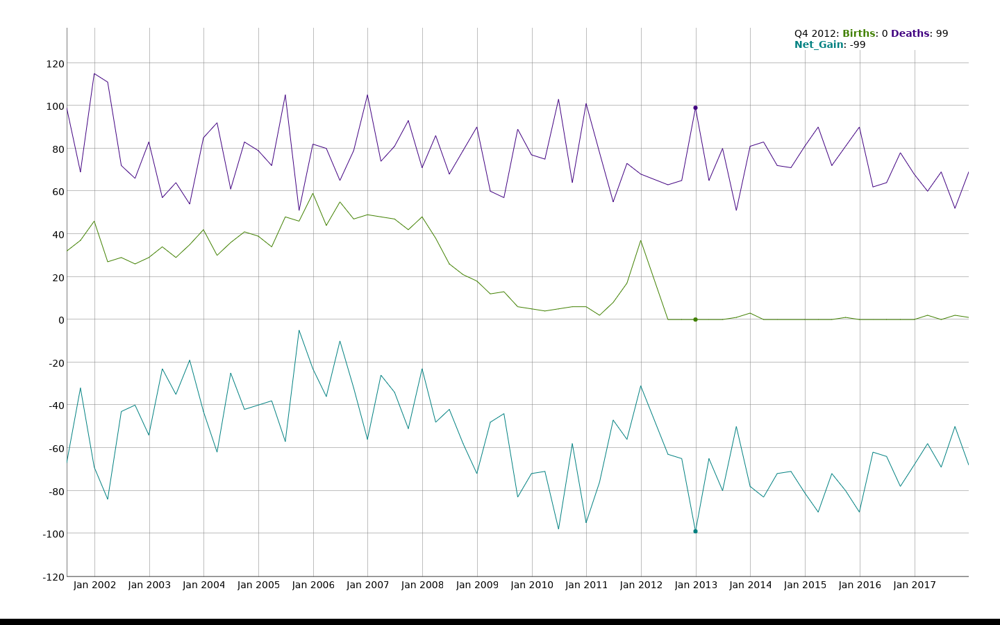

## Overview

This repo contains [FFIEC call reports](https://cdr.ffiec.gov/public/) for all banks by quarter.  At this point each schedule of bulk call reports are read into both a SQLite database, and saved separately as .rds files.  Queries are created to pull time series items from the .rds files.  Creating queries takes fairly good knowledge of FFIEC Call Reports.  Moreover the structure of these reports tends to change over time.

The repo has the following structure:

- Raw call report data: `/data`
- Queries of particular schedules: `/querying_data_and_analysis/individual_schedule_queries`
- Item queries which often operate across schedules: `/querying_data_and_analysis/item_queries`
- Various **prelimiary** analyses are in `/querying_data_and_analysis/analyses` Don't quote or cite any results, and many filoes here will change.  
- A reliminary panel data set I am working with (to investigate the relationship between capital levels and small business loans) is here: `querying_data_and_analysis/analyses/panel_data_analysis/full_panel/panel.rds`

## Example of Use

We can create a query to look at all banks births and deaths.  In R:

```
library(xts)
library(dygraphs)

quarters <- c("03312001", "06302001", "09302001", "12312001", "03312002", "06302002", "09302002", "12312002", "03312003", "06302003", "09302003", "12312003", "03312004", "06302004", "09302004", "12312004", "03312005", "06302005", "09302005", "12312005", "03312006", "06302006", "09302006", "12312006", "03312007", "06302007", "09302007", "12312007", "03312008", "06302008", "09302008", "12312008", "03312009", "06302009", "09302009", "12312009", "03312010", "06302010", "09302010", "12312010", "03312011", "06302011", "09302011", "12312011", "03312012", "06302012", "09302012", "12312012", "03312013", "06302013", "09302013", "12312013", "03312014", "06302014", "09302014", "12312014", "03312015", "06302015", "09302015", "12312015", "03312016", "06302016", "09302016", "12312016", "03312017", "06302017", "09302017", "12312017")

idrssds <- list()

for (q in quarters){
	tmp_bulk_por <- readRDS(url(paste0("https://github.com/Matt-Brigida/FFIEC_Call_Reports/blob/master/data/", q, "/bulk_POR_", q, ".rds?raw=true")))

	idrssds[[q]] <- tmp_bulk_por$IDRSSD

	Sys.sleep(5)
    }

### births
births <- list()

for (i in 2:length(quarters)){
    births[[quarters[i]]] <- idrssds[[i]][!(idrssds[[i]] %in% idrssds[[i - 1]])]
}

### deaths
deaths <- list()

for (i in 1:(length(quarters) - 1)){
    deaths[[quarters[i + 1]]] <- idrssds[[i]][!(idrssds[[i]] %in% idrssds[[i + 1]])]
}

## Vizualizations

### number births

num_births <- unlist(lapply(births, length))

### number deaths

num_deaths <- unlist(lapply(deaths, length))

### birth - death

net_gain <- num_births - num_deaths

### Plot

quarter_date <- as.Date(quarters, "%m%d%Y")

plot_data <- as.xts(cbind(num_births, num_deaths, net_gain), order.by = quarter_date[-1])
plot_data <- plot_data[index(plot_data) != "2012-03-31", ]

names(plot_data) <- c("Births", "Deaths", "Net_Gain")

dygraph(plot_data)
```

</img>
